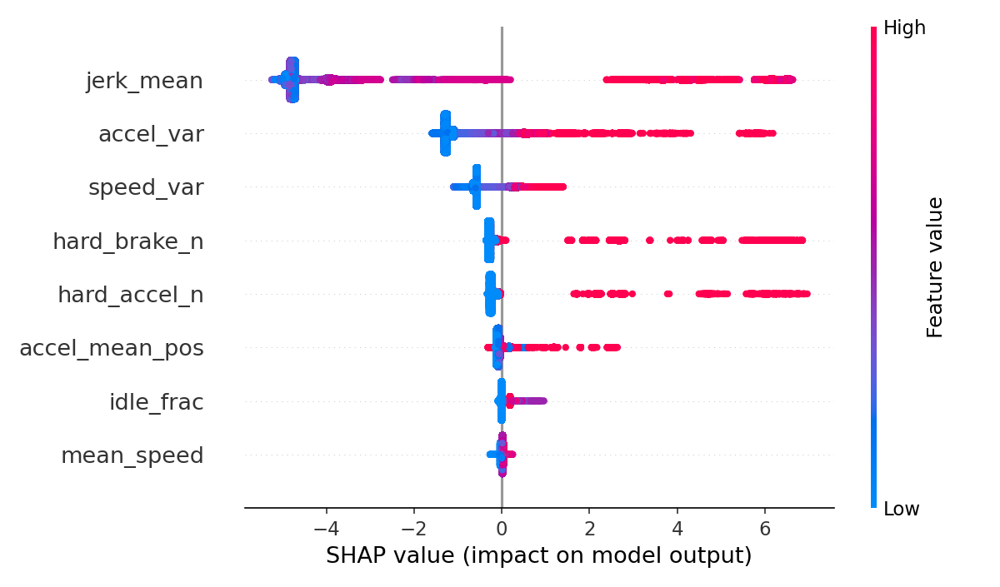
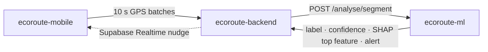

# EcoRoute ML: Explainable Driving-Behaviour Classifier

**Classifies every 10 seconds of smartphone GPS as *smooth*, *moderate* or *aggressive* driving, explains *why* with SHAP, and turns that into a specific real-time coaching tip, all without OBD-II hardware.**

Part of **EcoRoute**, our Final Year Project at Monash University Malaysia (2026):

| Repo | Role |
|---|---|
| [ecoroute-mobile](https://github.com/bentez7/ecoroute-mobile) | iOS/Android app: route planning, navigation, live coaching, trip history |
| [ecoroute-backend](https://github.com/bentez7/ecoroute-backend) | REST API, auth, database, orchestration (Node.js · Express · Supabase) |
| **ecoroute-ml** (this repo) | Driving-behaviour classifier with explainable feedback (XGBoost · SHAP · FastAPI) |
| [ecoroute-routing-engine](https://github.com/bentez7/ecoroute-routing-engine) | Energy-aware routing and trip energy simulation (NREL RouteE Compass · FASTSim) |

## Highlights

- **Trained on 4.4 million windows** from the public eVED dataset (32,450 trips, 384 vehicles).
- **12 grade-aware features** (speed/acceleration variance, hard brakes/accelerations, jerk, idle time, road gradient, terrain-adjusted counts), so braking down a hill isn't flagged as aggressive driving.
- **Non-circular labels:** classes come from k-means over a *physical energy signal* that the model never sees, rather than from the same thresholds the model learns. This avoids the common "model memorises its own labelling rules" trap.
- **Leakage-safe training:** trip-level `GroupShuffleSplit`, class-weighted XGBoost, a scaler fit on the training split only, `StratifiedGroupKFold` hyperparameter search, and isotonic probability calibration.
- **Explainable coaching:** a SHAP `TreeExplainer` picks the top feature behind each prediction and maps it to a human-readable tip. Alerts fire only when four gates hold (calibrated probability ≥ 0.80, three consecutive windows, a 15 s cooldown, and deviation from the driver's own baseline), which keeps nudges rare and meaningful.
- **Real-time:** FastAPI service with per-trip buffers. Inference plus SHAP takes about **1.2 ms mean / 1.6 ms p99** per window.

### Results (from our FYP paper)

| Evaluation | Weighted-F1 |
|---|---|
| Held-out trips | **0.946** |
| 77 completely unseen vehicles | **0.939** |
| Hardest case: ambiguous boundary windows on unseen vehicles | 0.729 |

Aggressive-class recall on held-out trips is 0.957. Scores measure agreement with the energy-based labels, not human judgement. A regressor trained on the same features reaches R² = 0.65 on the underlying energy signal, which shows the labels are physically grounded.



## How it fits in



**Team:** Teng Kong Cheng, Wong Wei Jian, Benjamin Tan En Zhe. Teng Kong Cheng built most of this service. My own work (Benjamin) was mainly on the [mobile app](https://github.com/bentez7/ecoroute-mobile), including the UI that presents these coaching results to the driver.

---

## Service API

| Method | Path | Purpose |
|---|---|---|
| GET | `/health` | Health check |
| POST | `/analyse/segment` | Production endpoint: push a batch of GPS points for a trip and get back labelled 10 s segments and any coaching alert |
| POST | `/classify`, `/trip/start`, `/trip/{id}/window`, GET `/trip/{id}/summary` | Development utilities for testing |

```bash
uvicorn api.main:app --host 0.0.0.0 --port 8000   # Swagger UI at http://localhost:8000/docs
```

Full request/response schemas are in [API.md](API.md).

## Project Structure

```
ecoroute-ml/
├── api/
│   └── main.py           # FastAPI service (per-trip buffers, gating, SHAP feedback)
├── ml/
│   ├── features.py       # Feature extraction from speed windows
│   └── detector.py       # RealTimeDetector for streaming inference
├── training/
│   ├── 01_load.py        # Load and clean eVED dataset
│   ├── 02_features.py    # Extract rolling-window features
│   ├── 03_label.py       # k-means labelling on energy signal
│   └── 04_train.py       # Train XGBoost classifier
├── tests/
│   └── test_detector.py  # Unit tests for RealTimeDetector
└── requirements.txt
```

## Prerequisites

- Python 3.10+
- eVED dataset (weekly CSV files) — download from [https://bitbucket.org/datarepo/eved-dataset](https://bitbucket.org/datarepo/eved-dataset)

## Setup

**1. Clone the repository**

```bash
git clone https://github.com/bentez7/ecoroute-ml.git
cd ecoroute-ml
```

**2. Create and activate a virtual environment**

```bash
python -m venv venv
source venv/bin/activate        # macOS/Linux
venv\Scripts\activate.bat       # Windows
```

**3. Install dependencies**

```bash
pip install -r requirements.txt
```

**4. Add the dataset**

Place the eVED weekly CSV files in:

```
training/data/eved/*.csv
```

> The `data/` folder is excluded from git. Do not commit raw data files.

## Training Pipeline

Run each step in order from the repo root:

```bash
# Step 1 — Load and clean raw eVED CSVs
python training/01_load.py

# Step 2 — Extract rolling-window features (10s window, 5s step)
python training/02_features.py

# Step 3 — Label windows via k-means on the energy signal (rule-based fallback)
python training/03_label.py

# Step 4 — Train XGBoost classifier and save model artifacts
python training/04_train.py
```

Trained model artifacts are saved to `ml/models/`:
- `clf_c1.pkl` — XGBoost classifier
- `scaler_c1.pkl` — fitted StandardScaler

## Running Tests

```bash
python -m pytest tests/ -v
```

Or without pytest:

```bash
python tests/test_detector.py
```

> Tests require trained model artifacts in `ml/models/`. Run the training pipeline first.

## Usage (Inference)

```python
from ml.detector import load_detector

detector = load_detector()

# Push a 10-second speed window (m/s)
alert = detector.push_window([10.0, 12.0, 8.0, 5.0, 0.0, 4.0, 11.0, 15.0, 9.0, 6.0], timestamp=10.0)

print(detector.last_label)   # 0=smooth, 1=moderate, 2=aggressive
print(alert)                 # Alert string or None

# Get trip summary
print(detector.get_trip_summary())
```
